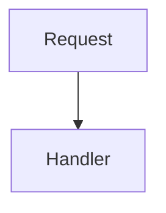

# Development Setup

## Prerequisites

- **Node.js** >= 24.11.0
- **pnpm** >= 10.25.0

## Getting Started

```bash
git clone https://github.com/ovineko/ovineko.git
cd ovineko
pnpm install
```

## Common Commands

### Building

```bash
# Build all packages (uses Turborepo for orchestration)
turbo build

# Build a specific package
cd packages/react-router
pnpm build
```

### Testing

```bash
# Run tests in a specific package
cd packages/react-router
pnpm test              # Run once
pnpm test:watch        # Watch mode
pnpm test:coverage     # With coverage report
pnpm test:ui           # Open Vitest UI
pnpm test:debug        # Console output visible (DEBUG=1)
```

Console output (`console.log`, `console.warn`, `console.error`) is suppressed during tests by default. Use `pnpm test:debug` to see it when diagnosing failures.

### Linting

```bash
# Lint all packages
pnpm lint

# Auto-fix issues
pnpm fix
```

The project uses **datamitsu** as a unified linting orchestrator that runs oxlint, ESLint, Prettier, knip, commitlint, syncpack, and gitleaks.

## Monorepo Structure

The repository uses **pnpm workspaces** and **Turborepo** for build orchestration:

- `spa-guard/` - The spa-guard package family (7 packages)
- `packages/` - Utility packages (react-router, clean-pkg-json, datamitsu-config, fastify-base)
- `website/` - This documentation site (Docusaurus)

Each package is self-contained with its own `package.json`, `tsconfig.json`, `vitest.config.ts`, and `tsup.config.ts`.

## Git Hooks

**lefthook** manages git hooks automatically:

- **pre-commit**: Runs `datamitsu fix` and `datamitsu lint` on staged files
- **commit-msg**: Validates commit messages with commitlint
- **post-checkout**: Runs `pnpm install` when switching branches

## Publishing a Package

1. Update version in `package.json` following [semver](https://semver.org/)
2. Run tests and linter: `pnpm test && pnpm lint`
3. Build: `pnpm build`
4. Publish: `pnpm publish --access public`

The `@ovineko/clean-pkg-json` tool automatically removes `devDependencies` during the prepack hook and restores them after publishing.

## Working with Documentation

The documentation site uses [Docusaurus](https://docusaurus.io/) and lives in the `website/` directory.

### Running Locally

```bash
pnpm --filter website dev
```

This starts a development server at `http://localhost:3000/` with hot reload. Changes to Markdown files are reflected immediately.

### Building

```bash
pnpm --filter website build
```

The build will fail on broken links (`onBrokenLinks: "throw"` is configured), so always verify the build succeeds before committing.

### Adding a New Documentation Page

1. Create a Markdown file in the appropriate directory under `website/docs/`:
   - `spa-guard/` for spa-guard family packages
   - `packages/` for utility packages
   - `getting-started/` for onboarding guides
   - `contributing/` for contributor guides

2. Add YAML frontmatter at the top of the file:

```yaml
---
title: Page Title
sidebar_position: 3
---
```

The `sidebar_position` controls the ordering within its category. Lower numbers appear first.

3. The sidebar is auto-generated per directory (configured in `website/sidebars.ts`), so new files are picked up automatically. No manual sidebar edits are needed.

### Linking Between Pages

Use relative paths for internal links:

```markdown
See the [core package](../spa-guard/core.md) for details.
```

Docusaurus resolves `.md` extensions to the correct URL at build time.

### Images and Static Assets

- Place images in `website/static/img/`
- Reference them in Markdown as `/img/filename.png`
- For diagrams, prefer Mermaid code blocks (rendered natively by Docusaurus):

````markdown

````

### Documentation Update Workflow

When modifying a package's public API or behavior:

1. Update the detailed documentation page in `website/docs/`
2. If the README quick-start example changed, update the package README too
3. Run `pnpm --filter website build` to verify no broken links
4. Commit documentation changes together with the code changes
