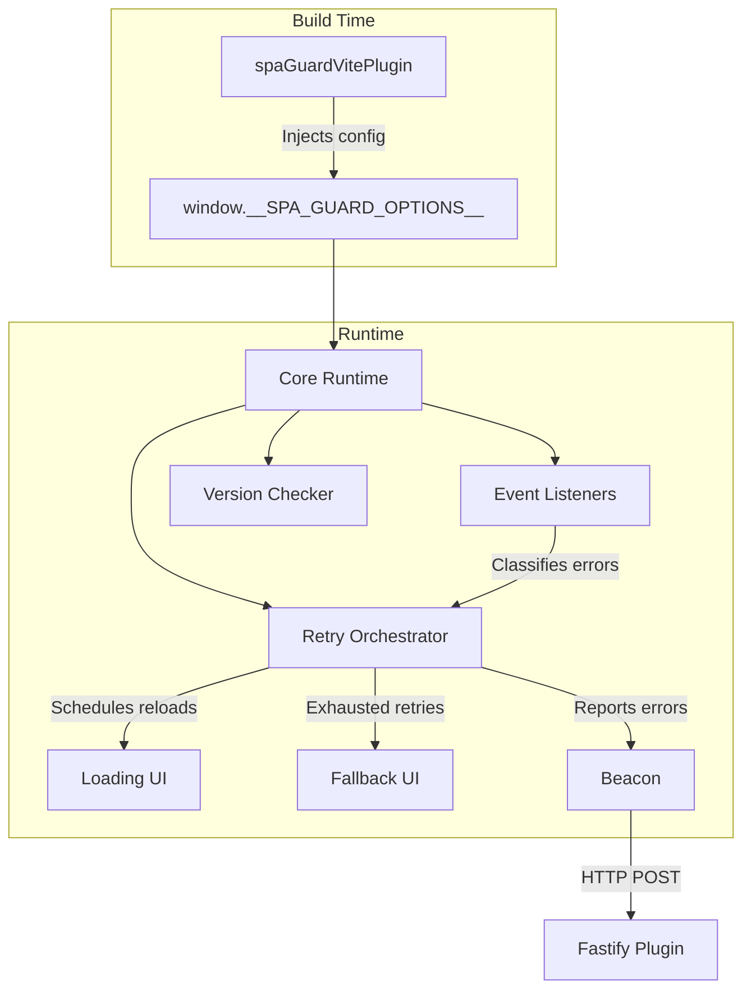

import Tabs from "@theme/Tabs";
import TabItem from "@theme/TabItem";

# SPA Guard

A family of packages for resilient single-page applications with automatic retry, cache busting, and error reporting.

## What is SPA Guard?

SPA Guard handles the "white screen of death" that occurs when your SPA's JavaScript chunks fail to load — whether from network issues, deployment cache invalidation, CDN problems, or static asset 404s. It automatically retries loading, shows user-friendly fallback UI, and reports errors via beacons.

## Package Family

The spa-guard functionality is split into 7 separate packages, each with a focused responsibility:

| Package                                           | Description                                                 | Peer Dependencies          |
| ------------------------------------------------- | ----------------------------------------------------------- | -------------------------- |
| [@ovineko/spa-guard](./core)                      | Core runtime, error handling, schema, i18n                  | None                       |
| [@ovineko/spa-guard-react](./react)               | React hooks, components, error boundaries                   | react@^19                  |
| [@ovineko/spa-guard-react-router](./react-router) | React Router v7 error boundary integration                  | react@^19, react-router@^7 |
| [@ovineko/spa-guard-vite](./vite)                 | Vite plugin (injects runtime script at build time)          | vite@^8\|\|^7              |
| [@ovineko/spa-guard-node](./node)                 | Server-side HTML cache with ETag/304, pre-compression, i18n | parse5@^8                  |
| [@ovineko/spa-guard-fastify](./fastify)           | Fastify beacon endpoint plugin and HTML cache handler       | fastify@^5\|\|^4           |
| [@ovineko/spa-guard-eslint](./eslint)             | ESLint rules for enforcing spa-guard patterns               | eslint@^9\|\|^10           |

## Architecture

Configuration flows from the Vite plugin at build time into the runtime:



### Two-Level Retry Strategy

1. **Module-level retry** (`lazyWithRetry` in spa-guard-react): Retries the individual `import()` call with configurable delays before the component fails.
2. **Page-level retry** (`retryOrchestrator` in core): If module retry fails, schedules a full page reload with cache busting.

### Retry State Machine

The orchestrator maintains an explicit phase:

- **idle** — no retry in progress
- **scheduled** — a reload has been scheduled; concurrent triggers are deduplicated
- **fallback** — retries exhausted, fallback UI is shown; further triggers are ignored

## Quick Start

### 1. Install packages

<Tabs>
  <TabItem value="pnpm" label="pnpm" default>
    ```bash
    pnpm add @ovineko/spa-guard @ovineko/spa-guard-react
    pnpm add -D @ovineko/spa-guard-vite
    ```
  </TabItem>
  <TabItem value="npm" label="npm">
    ```bash
    npm install @ovineko/spa-guard @ovineko/spa-guard-react
    npm install --save-dev @ovineko/spa-guard-vite
    ```
  </TabItem>
  <TabItem value="yarn" label="yarn">
    ```bash
    yarn add @ovineko/spa-guard @ovineko/spa-guard-react
    yarn add -D @ovineko/spa-guard-vite
    ```
  </TabItem>
  <TabItem value="bun" label="bun">
    ```bash
    bun add @ovineko/spa-guard @ovineko/spa-guard-react
    bun add -d @ovineko/spa-guard-vite
    ```
  </TabItem>
  <TabItem value="deno" label="deno">
    ```bash
    deno add npm:@ovineko/spa-guard npm:@ovineko/spa-guard-react npm:@ovineko/spa-guard-vite
    ```
  </TabItem>
</Tabs>

### 2. Add the Vite plugin

```ts
import { spaGuardVitePlugin } from "@ovineko/spa-guard-vite";
import { defineConfig } from "vite";

export default defineConfig({
  plugins: [spaGuardVitePlugin()],
});
```

### 3. Use lazyWithRetry in your React app

```tsx
import { Suspense } from "react";
import { lazyWithRetry } from "@ovineko/spa-guard-react";

const LazyHome = lazyWithRetry(() => import("./pages/Home"));

export function App() {
  return (
    <Suspense fallback={<div>Loading...</div>}>
      <LazyHome />
    </Suspense>
  );
}
```

### 4. Call recommendedSetup

```ts
import { recommendedSetup } from "@ovineko/spa-guard/runtime";

const cleanup = recommendedSetup();
```

See individual package pages for detailed API documentation and configuration options.
