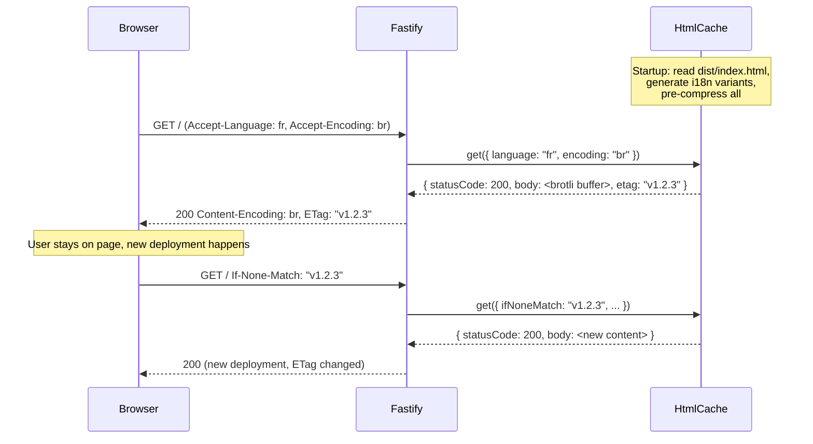

# Why Server-Side HTML Cache?

When JavaScript fails to load, who renders the fallback UI? This is the bootstrapping problem — and it's why `@ovineko/spa-guard-node` and `@ovineko/spa-guard-fastify` exist.

## The bootstrapping problem

A single-page application is a JavaScript application. Everything visible on screen — including error messages and fallback UI — is rendered by JavaScript. When a chunk load error occurs and the retry orchestrator exhausts its attempts, SPA Guard needs to show the user something useful.

But here's the catch: the JavaScript that would render that fallback UI might be the very thing that failed to load.

SPA Guard solves this by generating the fallback HTML at the orchestrator level, before React is involved. The fallback UI is injected directly into the DOM via `innerHTML` — no React, no virtual DOM, no bundled components. The templates are embedded in the core bundle at build time and rendered client-side.

This works well for the initial fallback render. But it has a constraint: the fallback HTML is static. Once the user's browser has it, there's no way to update it without a new deployment. This matters when:

- You have users in multiple languages
- Your fallback UI text changes across releases
- You want the fallback to reflect the current deployment's version

## Build-time embedding vs server-side cache

**Build-time embedding** means the fallback HTML is hardcoded into `index.html` at build time via the Vite plugin. It's simple — no server required. The limitations:

- Language is fixed at build time (one language per build, or one default)
- Updating fallback text requires a new deployment
- No content negotiation based on the user's `Accept-Language` header

**Server-side HTML cache** means the server generates the HTML response from the current `dist/index.html` at startup. The server holds the live version of the HTML and serves it with full HTTP semantics. The advantages:

- Language negotiation on every request (`Accept-Language` → patched i18n meta tag)
- ETag-based caching: browsers cache the response, but revalidate after each deployment
- Pre-compression: the server pre-generates gzip, brotli, and zstd variants at startup
- No stale fallback text: the HTML reflects the current deployment automatically

## How `createHtmlCache` works

`createHtmlCache` (from `@ovineko/spa-guard-node`) is the core of the server-side approach. At startup:

1. **Reads `dist/index.html`** — the built SPA entry point, which already contains the fallback HTML template injected by the Vite plugin
2. **Extracts the version** — reads `__SPA_GUARD_VERSION__` from the HTML to use as the ETag value
3. **Generates language variants** — for each configured locale, calls `patchHtmlI18n` to inject translated strings into a `<meta name="spa-guard-i18n">` tag in `<head>`
4. **Pre-compresses each variant** — produces gzip, brotli, and zstd buffers for each language variant at startup, so no compression work happens at request time
5. **Serves with ETag/304** — on each request, checks `If-None-Match`; if the ETag matches (same deployment), returns 304 with no body

When SPA Guard performs a cache-busting reload (appending `?spaGuardRetryAttempt=1&spaGuardCacheBust=<timestamp>`), the browser skips its local cache and hits the server. If the ETag has changed since the last visit (new deployment), the server returns the new HTML. The new HTML references new chunk URLs — and the app recovers.

## When you need it

The server-side HTML cache is **optional**. You don't need it to get the core retry behavior. You need it when:

- Your app targets multiple languages and the fallback UI should be localized
- You want precise cache invalidation tied to your deployment version (not time-based)
- You want to avoid serving stale fallback HTML to users after a deployment
- You're already running a Fastify server and want to consolidate HTML serving through it

If you're serving a purely static SPA from a CDN with no server component, the build-time embedding approach (just the Vite plugin) is sufficient.

## Related packages

- [`@ovineko/spa-guard-node`](./node) — `createHtmlCache`, `createHTMLCacheStore`, `patchHtmlI18n`, builder API
- [`@ovineko/spa-guard-fastify`](./fastify) — `spaGuardFastifyHandler`, `spaGuardBeaconPlugin`
- [`@ovineko/spa-guard-vite`](./vite) — Vite plugin that injects the fallback HTML template and runtime config at build time
